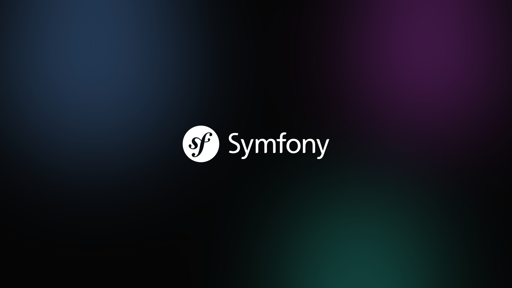

# Symfony Night

A dark [Omarchy](https://omarchy.org/) theme based on the dark mode of
[symfony.com](https://symfony.com): neutral grays, a soft blue link accent,
and GitHub-dark code highlighting colors.

> Unofficial community theme. Not affiliated with or endorsed by Symfony SAS.
> "Symfony" and the Symfony logo are trademarks of Symfony SAS. The logo is
> used as published at <https://symfony.com/logo>, unmodified except for
> removing its background box, and is not covered by this theme's MIT license.
> See the [Symfony Trademark & Logo Policy](https://symfony.com/trademark).



## Install

```sh
omarchy theme install https://github.com/cvtmal/omarchy-symfony-night-theme
```

Or choose *Install > Style > Theme* in the Omarchy menu (`Super + Space`) and paste the URL.
Press `Super + Ctrl + Space` to cycle backgrounds.

## Palette

All values come from symfony.com's own stylesheets (dark variant of each token).

| Role | Hex | On symfony.com |
| --- | --- | --- |
| Background | `#171717` | Page background |
| Dark background | `#0a0a0a` | Terminal component background |
| Lighter background | `#262626` | Code block background |
| Foreground | `#e5e5e5` | Body text |
| Dim foreground | `#a3a3a3` | Secondary text |
| Muted | `#525252` | Borders |
| Selection | `#404040` | Secondary surfaces |
| Accent | `#93c5fd` | Links and primary buttons |
| Red | `#ff7b72` | Syntax: keyword |
| Orange | `#ffa657` | Syntax: title |
| Green | `#7ee787` | Syntax: attribute / tag |
| Blue | `#79c0ff` | Syntax: variable |
| Magenta | `#d2a8ff` | Syntax: function |
| Cyan | `#a5d6ff` | Syntax: string |
| Yellow | `#fbbf24` | Warning alert border |
| Bright red | `#fb7185` | Danger text |
| Bright blue / cyan / magenta / green | `#60a5fa` `#67e8f9` `#d946ef` `#2dd4bf` | Homepage accent colors |

## Backgrounds

Generated for this theme from the palette. The first three show the official
white (negative) Symfony logo; the last three have no logo.

- `1-logo-glow.jpg`: horizontal logo on dimmed homepage accent glows
- `2-logo-neutral.jpg`: horizontal logo on a neutral vignette
- `3-logo-dot-grid.jpg`: vertical logo on a subtle dot grid
- `4-accent-glow.jpg`, `5-neutral.jpg`, `6-dot-grid.jpg`: the same without the logo

The source logo files are in `assets/`.

## License

MIT for the theme files and generated artwork. See [LICENSE](LICENSE).
The Symfony name and logo are excluded; they belong to Symfony SAS.
